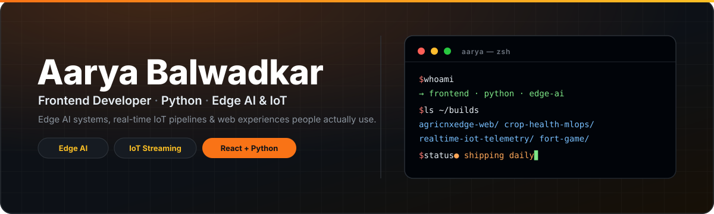
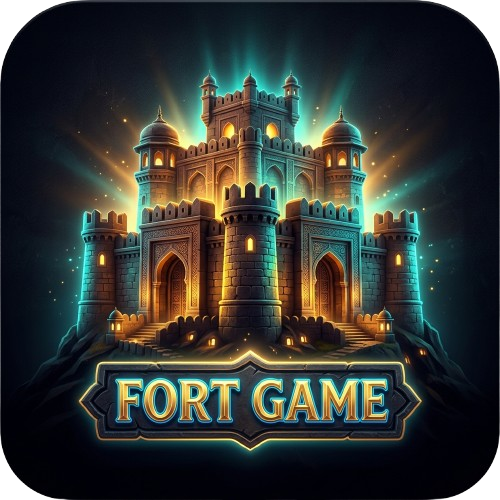

  

  <h1>Hi, I'm Aarya 👋</h1>
  
Frontend Developer · Python Programmer · based in Pune, India

  
<i>Edge AI systems, real-time IoT pipelines &amp; web experiences people actually use.</i>

  

    
    
  

---

### Selected work

- 🌾 **[Agri-CNX-Edge](https://github.com/AaryaBalwadkar/Agri-CNX-Edge)** — Edge AI for apple crops. One DINOv3 student, 4 tasks, ONNX → INT8 TFLite.
- 🌐 **[agricnxedge-web](https://github.com/AaryaBalwadkar/agricnxedge-web)** — Web frontend for Agri-CNX-Edge (v2). Crop-health dashboard + inference UI.
- 🩺 **[crop-health-mlops](https://github.com/AaryaBalwadkar/crop-health-mlops)** — MLOps crop-health inference: FastAPI + ONNX, React, Docker, K8s, Prometheus.
- 📡 **[realtime-iot-telemetry](https://github.com/AaryaBalwadkar/realtime-iot-telemetry)** — MQTT → Kafka → Spark → Postgres + Grafana. Real streaming, dockerized.
- 🏫 **[Shiksha-Sankalp](https://github.com/AaryaBalwadkar/Shiksha-Sankalp)** — Realtime classrooms (MERN + Socket.io, RBAC).

More builds

 

- 🛡️ SamrakshIQ — secure file flow: [backend](https://github.com/AaryaBalwadkar/samrakshiq-backend) · [frontend](https://github.com/AaryaBalwadkar/samrakshiq-frontend) · [model](https://github.com/AaryaBalwadkar/samrakshiq-model)
- 🤖 [cliqtrix-issueops](https://github.com/AaryaBalwadkar/cliqtrix-issueops) — Zoho Cliq × YouTrack ChatOps · [SchemeGist](https://github.com/AaryaBalwadkar/SchemeGist) · [AL-Demo](https://github.com/AaryaBalwadkar/AL-Demo)

All projects (auto-updated daily)

 

<!--START_SECTION:projects-->
| Project | Description | Language | ⭐ Stars | Updated |
|---|---|---|---|---|
| [crop-health-mlops](https://github.com/AaryaBalwadkar/crop-health-mlops) | MLOps crop-health inference: FastAPI + ONNX, React, Docker, K8s, Prometheus, Ansible, GCP | Python | 0 | Sep 27, 2026 |
| [agricnxedge-web](https://github.com/AaryaBalwadkar/agricnxedge-web) | Web frontend for Agri-CNX-Edge (v2) — crop-health dashboard + inference UI. | Python | 0 | Sep 22, 2026 |
| [Agri-CNX-Edge](https://github.com/AaryaBalwadkar/Agri-CNX-Edge) | Edge AI for Apple Crop Health | Python | 0 | Sep 21, 2026 |
| [realtime-iot-telemetry](https://github.com/AaryaBalwadkar/realtime-iot-telemetry) | An end-to-end, containerized IoT sensor telemetry pipeline processing real-time data with Apache... | Python | 0 | Sep 22, 2026 |
| [Shiksha-Sankalp](https://github.com/AaryaBalwadkar/Shiksha-Sankalp) | Flexi Credit Course CA3 Project | JavaScript | 0 | Nov 16, 2024 |
| [my-git-practice](https://github.com/AaryaBalwadkar/my-git-practice) | Git practice playground — branching, merges and rebases. | Python | 0 | Jul 22, 2026 |
| [MyWebsite](https://github.com/AaryaBalwadkar/MyWebsite) | Personal portfolio website. | HTML | 0 | Jul 17, 2026 |
| [volstory](https://github.com/AaryaBalwadkar/volstory) | Volunteer stories platform (TypeScript). | TypeScript | 0 | May 04, 2026 |
Auto-updated Sep 27, 2026 · featured first, then most recently pushed
<!--END_SECTION:projects-->

---

  FEATURED BUILD · LIVE
  <h2> fort-game.com</h2>
  
<b>The daily Indian forts mystery game.</b> One mystery fort every day. Every guess paints the map — cold when far, scorching when close.

  

  <table>
    <tr>
      <td align="center" width="33%"><b>🔎 Guess</b> 220+ verified forts, 24 states &amp; UTs</td>
      <td align="center" width="33%"><b>🌡️ Glow</b> 6-tier heatmap, no numbers, no arrows</td>
      <td align="center" width="33%"><b>🔥 Streak</b> daily challenge + practice mode</td>
    </tr>
  </table>

  

    
  

  
free · no login · React + TypeScript + Leaflet · scores stay on your device

  <!-- Gameplay screenshot: capture fort-game.com in action, save as
       assets/fort-gameplay.png, then uncomment the next line.
  
  -->

---

### Stack

  

---

### Stats

  
  
   
  
    
  <!-- Contribution snake: generated daily by .github/workflows/snake.yml -->
  <picture>
    <source media="(prefers-color-scheme: dark)" srcset="assets/github-snake-dark.svg" />
    
  </picture>

---

### Recent activity

<!--START_SECTION:activity-->
- 🔨 Pushed 1 commit(s) to [AaryaBalwadkar/crop-health-mlops](https://github.com/AaryaBalwadkar/crop-health-mlops) · Sep 27
- 🎉 Created branch `main` in [AaryaBalwadkar/crop-health-mlops](https://github.com/AaryaBalwadkar/crop-health-mlops) · Sep 27
- 🚀 Released [model-v1](https://github.com/AaryaBalwadkar/agricnxedge-web/releases) in [AaryaBalwadkar/agricnxedge-web](https://github.com/AaryaBalwadkar/agricnxedge-web) · Sep 22
- 🎉 Created branch `main` in [AaryaBalwadkar/agricnxedge-web](https://github.com/AaryaBalwadkar/agricnxedge-web) · Sep 22
- 🔨 Pushed 1 commit(s) to [AaryaBalwadkar/AaryaBalwadkar](https://github.com/AaryaBalwadkar/AaryaBalwadkar) · Sep 22
<!--END_SECTION:activity-->

---

  Currently: polishing <a href="https://fort-game.com">fort-game.com</a> · shipping Agri-CNX-Edge web v2 · learning backend scale · open to Python + React collabs
    
  
  &nbsp;
  
  &nbsp;
  

